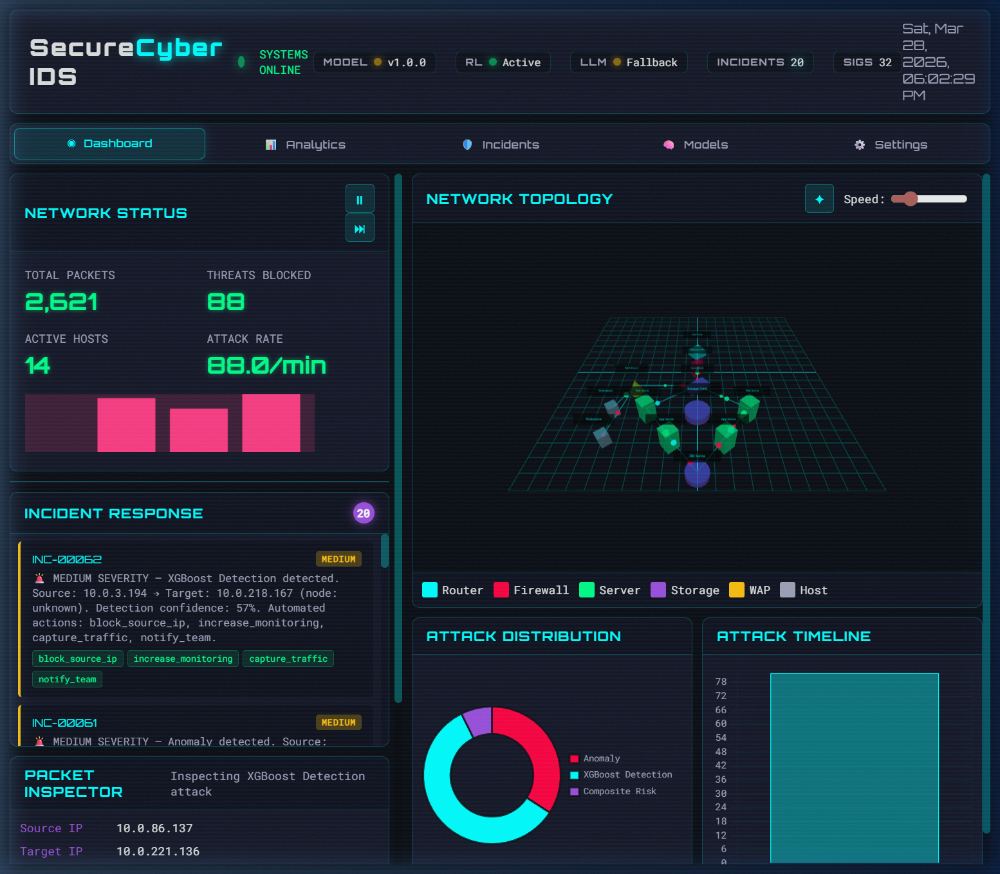
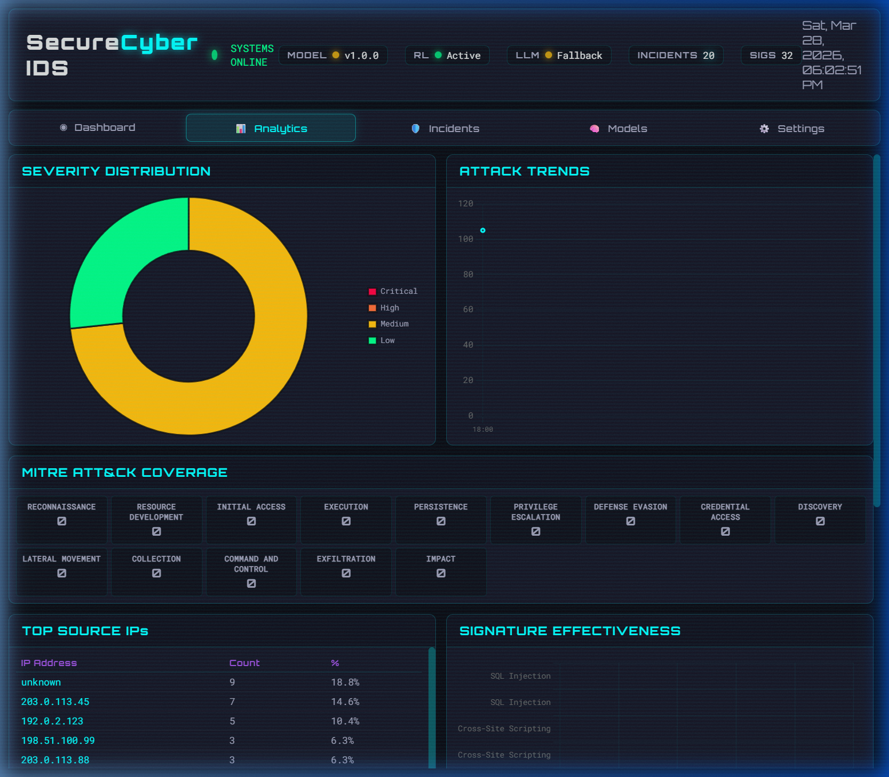
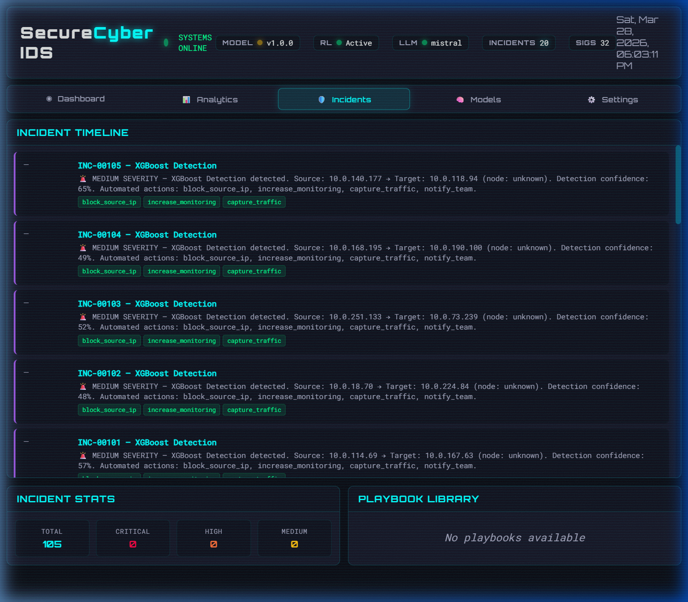
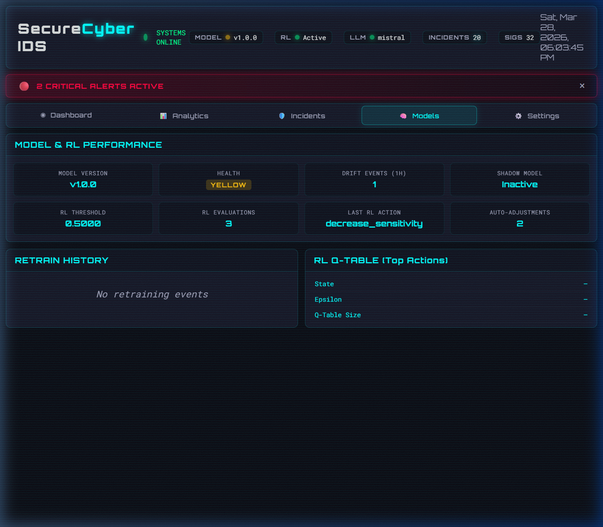
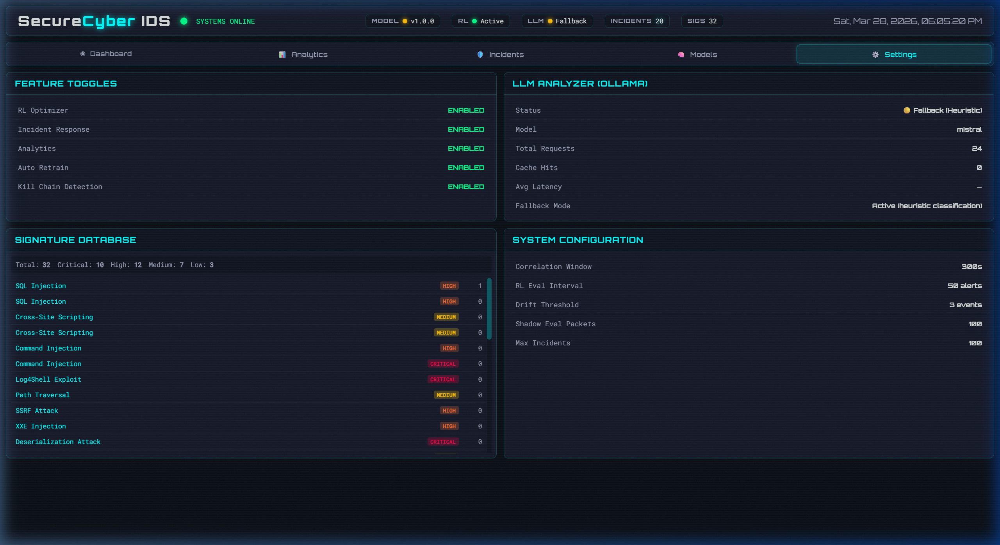
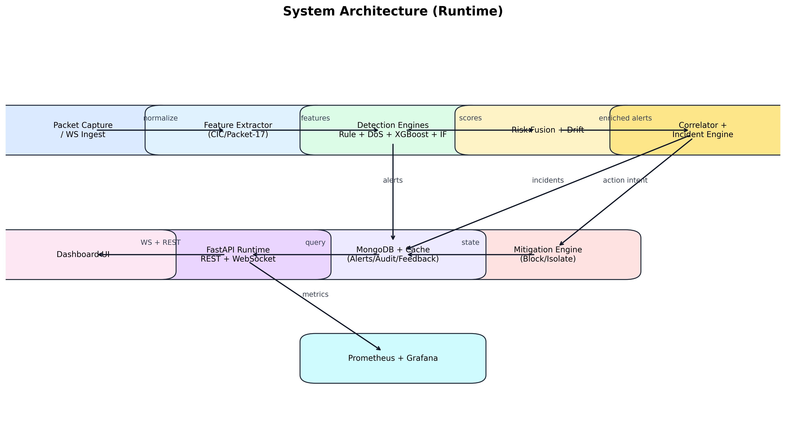
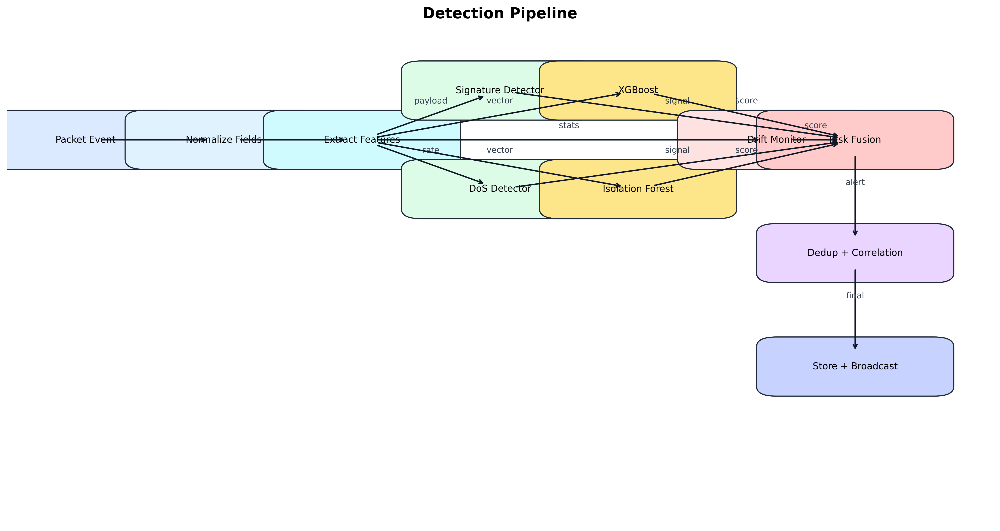

# SecureCyber IDS/IPS

> **AI-powered Intrusion Detection & Prevention System for Internal Networks**

A real-time, multi-layer IDS/IPS built with FastAPI, XGBoost, Isolation Forest, and a neon-themed dashboard. Features autonomous threshold tuning (RL), 7-stage kill chain detection, MITRE ATT&CK enrichment, 8 incident response playbooks, and optional LLM-powered alert triage via Ollama.

---

## 🖥️ Live Dashboard Screenshots

### Main Dashboard — Real-Time Network Monitoring


### Analytics — Severity Distribution, MITRE ATT&CK Coverage, Attack Trends


### Incidents — Timeline with Automated Response Actions


### Models — RL Optimizer, Drift Detection, Shadow A/B Retraining


### Settings — Feature Toggles, LLM Status, Signature Database


---

## 🎬 Demo Walkthrough


---

## 🏗️ System Architecture



### Detection Pipeline



---

## ✨ Highlights

| Feature | Details |
|---------|---------|
| **Multi-Layer Detection** | 32 YAML signatures + DDoS heuristics + XGBoost classifier + Isolation Forest anomaly |
| **Autonomous Intelligence** | RL optimizer (Q-learning) auto-adjusts thresholds every 50 alerts |
| **Kill Chain Detection** | 7-stage correlator: Recon → Weaponization → Exploitation → Credential Access → Lateral Movement → C2 → Exfiltration |
| **Incident Response** | 8 attack-specific playbooks with automated & manual steps |
| **MITRE ATT&CK Mapping** | 13 techniques across 14 tactics with dashboard heatmap |
| **4-Tier Severity** | Critical 🔴 / High 🟠 / Medium 🟡 / Low 🟢 with color-coded alerts |
| **5-Page Dashboard** | Dashboard, Analytics, Incidents, Models, Settings — with Chart.js |
| **LLM Alert Triage** | Optional Ollama/Mistral integration for TP/FP classification |
| **Deployment Ready** | Docker Compose with MongoDB, Redis, Prometheus, Grafana, Nginx |
| **Observability** | `/metrics` endpoint for Prometheus + pre-built Grafana dashboards |

---

## 📁 Repository Layout

```
├── backend/              FastAPI service, detectors, correlator, mitigation
│   ├── app/              Core application (main.py, sensors, features, etc.)
│   │   └── detectors/    Signature engine, XGBoost, DDoS, Isolation Forest
│   └── tests/            Backend test suite
├── frontend/             Static dashboard (HTML/CSS/JS) served by FastAPI or Nginx
├── models/               Pretrained XGBoost artifacts + training_scripts/
├── monitoring/           Prometheus config, Grafana dashboard, alert rules
├── scripts/              Setup, demo, simulation, and training helper scripts
├── tests/                Root-level pytest suite (API, DB, WebSocket, integration)
├── deploy/               Production Docker Compose + Nginx + risk profiles
└── docker-compose.yml    Full-stack deployment (6 containers)
```

---

## 🚀 Quickstart

### Prerequisites

- **Python 3.10+** — [python.org](https://python.org) (check "Add Python to PATH")
- **Npcap** (Windows, for live capture) — [nmap.org/npcap](https://nmap.org/npcap/) (select "WinPcap API-compatible Mode")
- **MongoDB** (optional) — system falls back to in-memory storage if unavailable

### Option A: Local Development

```bash
# 1. Clone
git clone https://github.com/KiRa-Hem/SecureCyber-Internal-network-IDS-framework.git
cd SecureCyber-Internal-network-IDS-framework

# 2. Create & activate virtual environment
python -m venv .venv
.\.venv\Scripts\Activate.ps1          # Windows PowerShell
# source .venv/bin/activate           # Linux/macOS

# 3. Install dependencies
pip install --upgrade pip
pip install -r backend/requirements.txt

# 4. Configure environment
copy backend/.env.example backend/.env
# Edit backend/.env — set API_TOKEN, ADMIN_TOKEN, JWT_SECRET
# For demo mode: set ENABLE_SIMULATION=true, ENABLE_PACKET_CAPTURE=false

# 5. Set PYTHONPATH and start server
$env:PYTHONPATH = "$PWD\backend"      # Windows
# export PYTHONPATH="$(pwd)/backend"  # Linux/macOS
cd backend
python main.py
```

Dashboard opens at **http://localhost:8000** — API docs at **http://localhost:8000/docs**

### Option B: Docker Compose

```bash
# 1. Clone
git clone https://github.com/KiRa-Hem/SecureCyber-Internal-network-IDS-framework.git
cd SecureCyber-Internal-network-IDS-framework

# 2. Create root .env with secrets
echo "API_TOKEN=$(python -c 'import secrets;print(secrets.token_hex(32))')" > .env
echo "ADMIN_TOKEN=$(python -c 'import secrets;print(secrets.token_hex(32))')" >> .env
echo "JWT_SECRET=$(python -c 'import secrets;print(secrets.token_hex(32))')" >> .env

# 3. Build & start all 6 services
docker compose up --build
```

| Service | URL |
|---------|-----|
| Dashboard (Nginx) | http://localhost |
| Backend API | http://localhost:8000 |
| API Docs | http://localhost:8000/docs |
| Prometheus | http://localhost:9090 |
| Grafana | http://localhost:3000 (admin/admin) |

### Option C: One-Click Demo (Windows)

```powershell
.\scripts\setup_env.ps1     # First-time setup
.\scripts\run_demo.ps1      # Starts server + simulator + opens browser
```

---

## 🎬 Conference Demo

Run the polished 5-stage kill chain attack scenario for live demonstrations:

```bash
python scripts/conference_demo.py          # Full speed (~2.5 min)
python scripts/conference_demo.py --fast   # Half-speed pauses
```

**5 Stages:** Reconnaissance → Exploitation → Credential Access → Lateral Movement → Exfiltration

Watch the dashboard in real-time to see kill chain detection, severity classification, and incident response.

---

## ⚙️ Configuration

All settings are managed via `backend/.env`. Key variables:

```env
# Security (MUST change for production)
API_TOKEN=replace-with-random-viewer-token
ADMIN_TOKEN=replace-with-random-admin-token
JWT_SECRET=replace-with-random-jwt-secret

# Detection
CONFIDENCE_THRESHOLD=0.99
ENABLE_SIMULATION=true                    # Demo mode
ENABLE_PACKET_CAPTURE=false               # Set true for live capture

# Autonomous Intelligence
RL_ENABLED=true                           # RL optimizer
IR_ENABLED=true                           # Incident response
AUTO_RETRAIN_ENABLED=true                 # Model auto-retrain
RISK_SCORING_ENABLED=true                 # Dual-pipeline risk fusion
```

See [`backend/.env.example`](backend/.env.example) for all available options.

---

## 🔍 How Detection Works

1. **Sensors** capture or simulate traffic and extract features
2. **4 Detectors** run in parallel: 32 YAML signatures, DoS heuristics, XGBoost, Isolation Forest
3. **Risk Fusion** computes weighted composite score (XGBoost 55% + Anomaly 30% + Drift 15%)
4. **RL Optimizer** auto-adjusts XGBoost threshold via Q-learning every 50 alerts
5. **MITRE ATT&CK** enriches alerts with technique IDs (T1190, T1498, etc.)
6. **Kill Chain Correlator** tracks 7-stage attack progressions per source IP
7. **Incident Response** maps alerts to 8 playbooks with automated response steps
8. **LLM Triage** (optional) classifies alerts as TP/FP and corrects RL optimizer
9. **Model Updater** monitors for drift and performs shadow A/B retraining
10. **Dashboard** streams events in real-time over WebSocket

---

## 🔌 API Endpoints

| Method | Path | Description |
|--------|------|-------------|
| `GET` | `/health` | System health check |
| `GET` | `/api/stats` | Network statistics |
| `GET` | `/api/alerts` | Recent alerts |
| `GET` | `/api/analytics` | Aggregated analytics |
| `GET` | `/api/incidents` | Active incidents |
| `GET` | `/api/kill-chains` | Kill chain tracking |
| `GET` | `/api/mitre-coverage` | MITRE ATT&CK coverage |
| `GET` | `/api/signatures` | All 32 signatures + match stats |
| `GET` | `/api/rl-status` | RL optimizer status |
| `GET` | `/api/model-status` | Model health & drift info |
| `POST` | `/api/simulate-attack` | Inject test alert (admin) |
| `POST` | `/api/block-ip` | Block an IP (admin) |
| `GET` | `/api/blocklist` | Current blocklist |
| `GET` | `/metrics` | Prometheus metrics |
| `WS` | `/ws` | Real-time WebSocket |

All endpoints require `X-Api-Key` header or JWT token. See [API Docs](http://localhost:8000/docs) when running.

---

## 🧪 Testing

```bash
# Run full test suite
pytest

# Run specific tests
pytest tests/test_integration.py     # Full pipeline validation
pytest tests/test_api.py             # API endpoints
pytest tests/test_detectors.py       # All 4 detectors
pytest tests/test_risk_fusion.py     # Risk scoring
pytest tests/test_websocket.py       # WebSocket flows
```

---

## 🤖 Models & Training

Pre-trained XGBoost model ships in `models/cic/`. To retrain:

```bash
# Preprocess dataset
python models/training_scripts/preprocess_cic.py \
  --input-file data/raw/cic.csv --output-dir data/cic

# Train models
python models/training_scripts/train_models.py \
  --data-dir data/cic --model-dir models/cic
```

---

## 📊 Monitoring

- **Prometheus** scrape config: `monitoring/prometheus.yml`
- **Grafana** dashboard: `monitoring/grafana_dashboard.json`
- **Alert rules**: `monitoring/alert_rules.yml`
- **Application logs**: `backend/logs/ids.log`, `backend/logs/audit.log`

---

## 🔒 Production Readiness

1. Terminate TLS at a reverse proxy; never expose uvicorn directly
2. Store tokens in a secrets manager; don't commit `.env` to VCS
3. Enforce rate limiting (`deploy/nginx.conf`: API 30 req/s, WS 10 req/s)
4. Run multiple backend replicas behind a load balancer
5. Use managed MongoDB with backups and TTL indexes
6. Schedule periodic retraining + drift evaluation

See [`deploy/README.md`](deploy/README.md) for production deployment guide.

---

## 📄 License

MIT License. See [LICENSE](LICENSE) for details.
